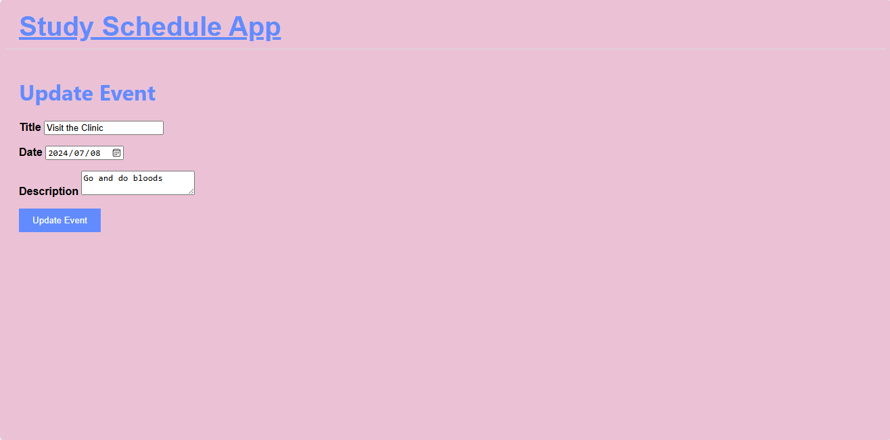

# Study Schedule App



## Introduction

The Study Schedule App is a minimalistic task manager and calendar bookmarker designed to help students and professionals organize and structure their study needs with ease. The app was inspired by the personal struggle of balancing school and work schedules, leading to the creation of a simple yet effective tool to manage tasks, objectives, and calendar events.

**Author:**  
- [GitHub](https://github.com/Phxsha)  
- [LinkedIn](https://www.linkedin.com/in/teboho-sifiso-phasha-191a28211)  

## Installation

To get started with the Study Schedule App, follow these steps:

1. Clone the repository:
   ```bash
   git clone https://github.com/Phxsha/Study_Schedule_App.git
   cd Study_Schedule_App

2. Install the required packages:
   ```bash
   pip install -r requirements.txt

3. Create the database:
   ```bash
   python create_db.py

4. Run the application:
   ```bash
   python app.py

5. Open your browser and go to:
   http://127.0.0.1:5000

## Usage

The Study Schedule App allows you to:

Register and log in to your account
Add, update, and delete study objectives
Mark objectives as complete and view them as achievements
Add, update, and delete calendar events
View your study schedule and objectives in an organized manner

## Contributing:

If you would like to contribute to the project, please fork the repository and submit a pull request. Contributions are welcome and appreciated!

## Licensing:

This project is licensed under the MIT License. See the [License](LICENSE) file for details.

This project was developed solo by Phxsha as a solution to the challenge of managing study and work schedules effectively. If you have any questions or feedback, feel free to reach out via GitHub or LinkedIn.
